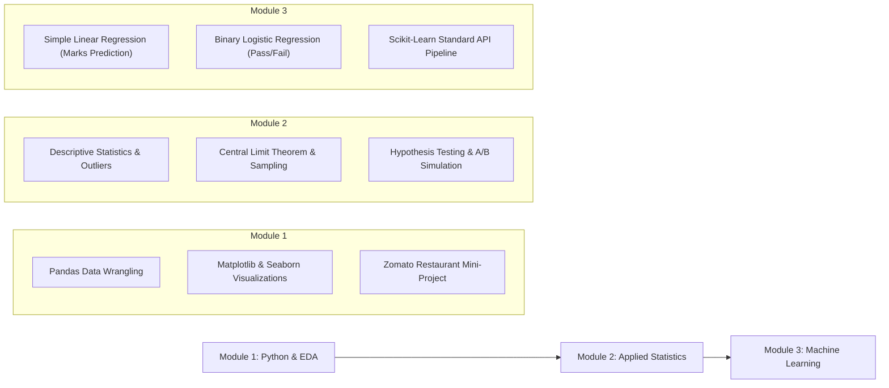

# 📊 Data Science & Machine Learning Training (DSML)

[](https://www.python.org/)
[](https://pandas.pydata.org/)
[](https://numpy.org/)
[](https://scikit-learn.org/)
[](https://jupyter.org/)
[](https://colab.research.google.com/)

Welcome to the **Data Science and Machine Learning (DSML) Training** repository! This project contains a comprehensive, curriculum-driven hands-on guide covering the full data science lifecycle: from **data wrangling and exploratory data analysis (EDA)** to **applied statistics and hypothesis testing**, and foundational **supervised machine learning models**.

---

## 🗺️ Curriculum Overview



---

## 📁 Repository Directory Structure

```text
ML-DataScience-Training/
├── README.md                                          # Master repository documentation
│
├── Module1/                                           # Data Wrangling & Exploratory Data Analysis
│   ├── README.md                                      # Module 1 guide
│   ├── datasets/                                      # Practice datasets
│   │   ├── customer_seg.csv                           # Customer segmentation dataset
│   │   ├── salary_dataset (1) (1).csv                 # Experience vs. Salary dataset
│   │   └── zomato_eda_mini_project.csv                # Zomato restaurant analytics data
│   └── project-Notebooks/                             # Hands-on Colab/Jupyter notebooks
│       ├── Pandas.ipynb                               # Data manipulation, filtering, aggregation
│       ├── EDAMatSea.ipynb                            # Visualization using Matplotlib & Seaborn
│       └── ZomatoBasedMiniProject.ipynb               # End-to-end EDA case study on Zomato data
│
├── Module2/                                           # Applied Statistics for Data Science
│   ├── README.md                                      # Module 2 guide
│   ├── Descriptive_Statistics_Hands_On_Colab.ipynb    # Mean, median, IQR, variance, outliers
│   ├── Sampling_and_Central_Limit_Theorem.ipynb       # Sampling distributions & CLT simulations
│   └── Statistics_Mini_project_salesData.ipynb        # Hypothesis testing, A/B testing & heatmaps
│
└── Module3/                                           # Supervised Machine Learning Fundamentals
    ├── README.md                                      # Module 3 guide
    └── project-notebooks/
        ├── README.md                                  # In-depth notebook walkthroughs
        ├── Linear_Regression_Student_Marks.ipynb      # Continuous target regression (Hours vs Marks)
        └── Logistic_Regression_Student_Pass_Fail.ipynb # Binary classification & probability (Pass/Fail)
```

---

## 📘 Module Breakdown

### 🔹 [Module 1: Python Data Analysis & EDA](file:///d:/DSML/ML-DataScience-Training/Module1/README.md)
Focuses on acquiring, cleaning, preparing, and exploring datasets using Python's standard data science toolchain.
* **[`Pandas.ipynb`](file:///d:/DSML/ML-DataScience-Training/Module1/project-Notebooks/Pandas.ipynb)**: DataFrames, indexing, boolean filtering, missing value imputation, transformations, and groupby aggregations.
* **[`EDAMatSea.ipynb`](file:///d:/DSML/ML-DataScience-Training/Module1/project-Notebooks/EDAMatSea.ipynb)**: Univariate, bivariate, and multivariate visualizations using `matplotlib.pyplot` and `seaborn` (box plots, histograms, pairplots, violin plots).
* **[`ZomatoBasedMiniProject.ipynb`](file:///d:/DSML/ML-DataScience-Training/Module1/project-Notebooks/ZomatoBasedMiniProject.ipynb)**: Practical end-to-end exploratory analysis analyzing restaurant ratings, price ranges, cuisines, and regional consumer preferences.

---

### 🔹 [Module 2: Applied Statistics for Data Science](file:///d:/DSML/ML-DataScience-Training/Module2/README.md)
Establishes the mathematical intuition and statistical rigor essential for machine learning and business decision-making.
* **[`Descriptive_Statistics_Hands_On_Colab.ipynb`](file:///d:/DSML/ML-DataScience-Training/Module2/Descriptive_Statistics_Hands_On_Colab.ipynb)**:
  * Measures of Central Tendency (Mean, Median, Mode) and Dispersion (Range, Variance, Standard Deviation).
  * Quartiles, Percentiles, and Interquartile Range (IQR) for outlier detection.
  * Translating statistical summaries into actionable business insights.
* **[`Sampling_and_Central_Limit_Theorem.ipynb`](file:///d:/DSML/ML-DataScience-Training/Module2/Sampling_and_Central_Limit_Theorem.ipynb)**:
  * Understanding populations vs. representative samples.
  * Experimental proof of the **Central Limit Theorem (CLT)** using $1,000$ sample means to demonstrate normality regardless of the underlying population distribution.
* **[`Statistics_Mini_project_salesData.ipynb`](file:///d:/DSML/ML-DataScience-Training/Module2/Statistics_Mini_project_salesData.ipynb)**:
  * Parametric hypothesis testing ($t$-tests, $p$-values, confidence levels).
  * Distribution fitting with `scipy.stats`.
  * Simulated **A/B Testing** analysis and feature correlation heatmaps.

---

### 🔹 [Module 3: Supervised Machine Learning Fundamentals](file:///d:/DSML/ML-DataScience-Training/Module3/README.md)
Introduces the core concepts of supervised predictive modeling with Scikit-Learn:
* **[`Linear_Regression_Student_Marks.ipynb`](file:///d:/DSML/ML-DataScience-Training/Module3/project-notebooks/Linear_Regression_Student_Marks.ipynb)**:
  * **Objective**: Predict a continuous numerical value (Exam Marks) given study hours.
  * **Key Concepts**: Feature matrices ($X$) vs. target vectors ($y$), ordinary least squares fitting ($y = mx + c$), plotting the regression line, inference with `.predict()`.
* **[`Logistic_Regression_Student_Pass_Fail.ipynb`](file:///d:/DSML/ML-DataScience-Training/Module3/project-notebooks/Logistic_Regression_Student_Pass_Fail.ipynb)**:
  * **Objective**: Predict discrete classification (Pass `1` vs. Fail `0`) along with confidence probabilities.
  * **Key Concepts**: The Sigmoid/Logistic activation curve ($P(Y=1) = \frac{1}{1 + e^{-z}}$), binary decision thresholds, comparing `.predict()` with `.predict_proba()`.

---

## 📊 Datasets Catalog

The [`Module1/datasets/`](file:///d:/DSML/ML-DataScience-Training/Module1/datasets) directory provides the datasets used throughout the practical sessions:

| Dataset File | Domain | Key Features | Usage |
| :--- | :--- | :--- | :--- |
| **`customer_seg.csv`** | Retail & Marketing | Demographics, spending score, annual income | Exploratory analysis, segmentation |
| **`salary_dataset (1) (1).csv`** | HR & Compensation | Years of experience, annual salary | Regression analysis, bivariate plots |
| **`zomato_eda_mini_project.csv`** | Food & Hospitality | Restaurant name, location, cuisine, aggregate rating, cost | Comprehensive EDA mini-project |

---

## 💻 Tech Stack & Dependencies

The project relies on standard, production-grade Python data science libraries:

* **Language**: Python 3.8+
* **Data Manipulation**: `pandas`, `numpy`
* **Visualization**: `matplotlib`, `seaborn`
* **Statistics & Inference**: `scipy`
* **Machine Learning**: `scikit-learn`
* **Interactive Environments**: `jupyter`, `google-colab`

### Installation

Clone the repository and install all required packages:

```bash
# Clone the repository
git clone https://github.com/jatingow/DSML.git
cd DSML/ML-DataScience-Training

# Install dependencies
pip install numpy pandas matplotlib seaborn scipy scikit-learn jupyter
```

---

## 🚀 How to Run the Notebooks

### Option 1: Run Locally (Jupyter Lab / VS Code)
1. Open the project folder in VS Code or launch Jupyter Lab:
   ```bash
   jupyter lab
   ```
2. Navigate to the desired module folder (`Module1/project-Notebooks`, `Module2/`, or `Module3/project-notebooks/`).
3. Select your Python kernel and run the cells interactively.

### Option 2: Run in Google Colab (Zero-Setup)
1. Navigate to [Google Colab](https://colab.research.google.com/).
2. Select **Upload** and upload any `.ipynb` file from the repository.
3. If the notebook requires a dataset (e.g. Module 1), upload the corresponding CSV from `Module1/datasets/` into your Colab session storage.
4. Run all cells (`Ctrl + F9` or `Shift + Enter`).

---

## 📈 Learning Progression

For the best learning experience, work through the repository in sequence:

1. **Step 1: Data Foundations** – Start with `Module1` to master data wrangling and visualization.
2. **Step 2: Statistical Intuition** – Complete `Module2` to understand variance, distributions, CLT, and hypothesis testing.
3. **Step 3: Predictive Modeling** – Advance to `Module3` to build, fit, evaluate, and interpret supervised ML models.

---

## 🤝 Contributing & License

Contributions, improvements, and new problem scenarios are welcome! Feel free to fork the repository, submit pull requests, or file issues for questions and feedback.
